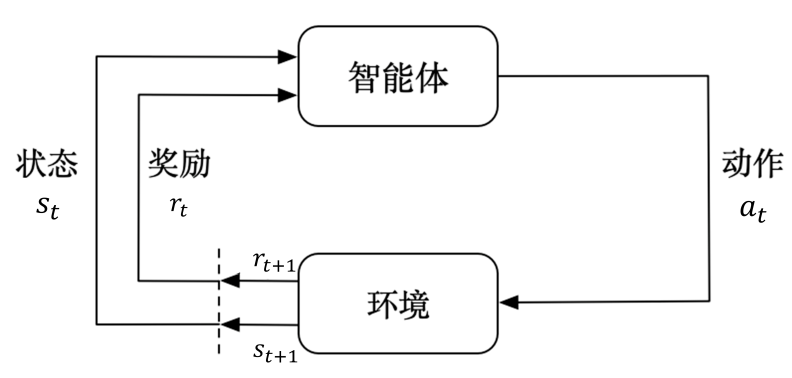

# 一、强化学习概述

什么是强化学习：强化学习 (reinforcement learning, RL) 讨论的问题是**智能体 (agent)** 怎么在复杂、不确定的**环境** (environment) 里面去最大化它能获得的**奖励**。如图所示, 强化学习由两部分组成: 智能体和环境。在强化学习过程中, 智能体与环境一直在交互：

1. 智能体在环境里面获取某个状态后, 它会利用该状态输出 一个**动作** (action), 这个动作也称为**决策**(decision)。
2. 然后这个动作会在**环境**之中被执行, 环境会根据智能体采取的动作, 输出下一个**状态**以及当前这个动作带来的**奖励**。智能体的目的就是尽可能多地从环境中获取奖励。

<!--  -->

    

        
    

<!-- 

    A simple, elegant caption looks good between image rows, after each row, or doesn't have to be there at all.

 -->

## 1.1 强化学习与监督学习

1. 监督学习：监督学习（supervised learning）首先假设我们有大量被标注的数据，这些图片都要满足**独立同分布**，即它们之间是没有关联关系的。所以在监督学习过程中，有两个假设。
    1. 输入的数据（标注的数据）都应是没有关联的。因为如果输入的数据有关联，学习器（learner）是不好学习的；
    2. 我们告诉学习器正确的标签是什么，这样它可以通过正确的标签来修正自己的预测。
2. 在强化学习里面，监督学习的两个假设其实都不满足。
    1. 智能体得到的观测（observation）不是独立同分布的，上一帧与下一帧间其实有非常强的连续性。我们得到的数据是相关的时间序列数据，不满足独立同分布。
    2. 另外，我们并没有立刻获得反馈，游戏没有告诉我们哪个动作是正确动作。比如我们现在把木板往右移，这只会使得球往上或者往左去一点儿，我们并不会得到立刻的反馈。因此，强化学习之所以这么困难，是因为智能体不能得到即时的反馈，然而我们依然希望智能体在这个环境里面学习。
3. 区别总结：
    1. 强化学习输入的样本是序列数据，而不像监督学习里面样本都是独立的。
    2. 学习器并没有告诉我们每一步正确的动作应该是什么，学习器需要自己去发现哪些动作可以带来 最多的奖励，只能通过不停地尝试来发现最有利的动作。
    3. 智能体获得自己能力的过程，其实是不断地试错探索（trial-and-error exploration）的过程。探索 （exploration）和利用（exploitation）是强化学习里面非常核心的问题。其中，探索指尝试一些新的动作， 这些新的动作有可能会使我们得到更多的奖励，也有可能使我们“一无所有”；利用指采取已知的可以获得最多奖励的动作，重复执行这个动作，因为我们知道这样做可以获得一定的奖励。因此，我们需要在探 索和利用之间进行权衡，这也是在监督学习里面没有的情况。
    4. 在强化学习过程中，没有非常强的监督者（supervisor），只有**奖励信号（reward signal）**，并且奖励信号是延迟的。

## 1.2 强化学习的特征

1. 强化学习会试错探索，它通过探索环境来获取对环境的理解。
2. 强化学习智能体会从环境里面获得延迟的奖励。
3. 在强化学习的训练过程中，时间非常重要。因为我们得到的是有时间关联的数据（sequential data）， 而不是独立同分布的数据。
4. 智能体的动作会影响它随后得到的数据。在训练智能体的过程中，很多时候我们也是通过正在学习的智能体与环境交互来得到数据的。所以如果在训练过程中，智能体不能保持稳定，就会使我们采集到的数据非常糟糕。我们通过数据来训练智能体，如果数据有问题，整个训练过程就会失败。所以在强化学习里面一个非常重要的问题就是，怎么让智能体的动作一直稳定地提升。

# 二、序列决策

## 2.1 智能体和环境

强化学习研究的问题是智能体与环境交互的问题。智能体把它的动作输出给环境，环境取得这个动作后会进行下一步，把下一步的观测与这个动作带来的奖励返还给智能体。这样的交互会产生很多观测，智能体的目的是从这些观测之中学到能最大化奖励的策略。

    

        
    

## 2.2 奖励

奖励是由环境给的一种**标量的反馈信号**（scalar feedback signal），这种信号可显示智能体在某一步采 取某个策略的表现如何。强化学习的目的就是最大化智能体可以获得的奖励，智能体在环境里面存在的目的就是最大化它的期望的累积奖励（expected cumulative reward）。不同的环境中，奖励也是不同的。

## 2.3 序列决策

在一个强化学习环境里面，智能体的目的就是选取一系列的动作来最大化奖励，所以这些选取的动作 必须有长期的影响。但在这个过程里面，智能体的奖励其实是被延迟了的，就是我们现在选取的某一步动作，可能要等到很久后才知道这一步到底产生了什么样的影响。强化学习里面一个重要的课题就是近期奖励和远期奖励的权衡 （trade-off），研究怎么让智能体取得更多的远期奖励。在与环境的交互过程中，智能体会获得很多观测。针对每一个观测，智能体会采取一个动作，也会得到一个奖励。

1. **历史**是**观测、动作、奖励**的序列：
    
    $$
    H_t=o_1, a_1, r_1, \ldots, o_t, a_t, r_t
    $$
    
2. 智能体在采取当前动作的时候会依赖于它之前得到的历史，所以我们可以把整个游戏的**状态**看成关于这个**历史**的函数：
    
    $$
    S_t=f\left(H_t\right)
    $$
    
3. 观测和状态的区别：**状态**是对世界的完整描述，不会隐藏世界的信息。**观测**是对状态的部分描述，可能会遗漏一些信息。在深度强化学习中，我们几乎总是用实值的向量、矩阵或者更高阶的张量来表示状态和观。
4. **环境**有自己的函数$$S_t^e=f^e\left(H_t\right)$$ 来更新状态，在**智能体**的内部也有一个函数$$S_t^a=f^a\left(H_t\right)$$来更新状态。
5. 马尔可夫决策（Markov decision process，MDP）过程：当智能体的状态与环境的状态等价的时候，即当智能体能够观察到环境的所有状态时，我们称这个环境是完全可观测的（fully observed）。在这种情况下面，强化学习通常被建模成一个马尔可夫决策过程的问题。在马尔可夫决策过程中，$$O_t=S_t^e=S_t^a$$。
6. 部分可观测马尔可夫决策过程（partially observable Markov decision process, POMDP）：智能体得到的观测并不一定能包含环境运作的所有状态，因为在强化学习的设定里面， 环境的状态才是真正的所有状态。当智能体只能看到部分的观测，我们就称这个环境是部分可观测的（partially observed）。 在这种情况下，强化学习通常被建模成部分可观测马尔可夫决策过程的问题。部分可观测马尔可夫决策过程是马尔可夫决策过程的一种泛化。 部分可观测马尔可夫决策过程依然具有马尔可夫性质，但是假设智能体无法感知环境的状态，只能知道部分观测值。部分观测值。比如在自动驾驶中，智能体只能感知传感器采集的有限的环境信息。
    
    😈 部分可观测马尔可夫决策过程可以用一个七元组描述：$$(S, A, T, R, \Omega, O, \gamma)$$。其中$$S$$表示状态空间，为隐变量，$$A$$为动作空间，$$T\left(s^{\prime} \mid s, a\right)$$为状态转移概率，$$R$$ 为奖励函数，$$\Omega(o \mid s, a)$$为观测概率,$$o$$为观测空间，$$\gamma$$为折扣系数。
    

# 三、动作空间

不同的环境允许不同种类的动作。在给定的环境中，**有效动作的集合**经常被称为**动作空间**（action space）。像雅达利游戏和围棋（Go）这样的环境有**离散动作空间**（discrete action space），在这个动作 空间里，智能体的动作数量是有限的。在其他环境，比如在物理世界中控制一个智能体，在这个环境中就有**连续动作空间**（continuous action space）。在连续动作空间中，动作是实值的向量。

例如，走迷宫机器人如果只有往东、往南、往西、往北这 4 种移动方式，则其动作空间为离散动作空 间；如果机器人可以向 360 ◦ 中的任意角度进行移动，则其动作空间为连续动作空间。

# 四、强化学习智能体的组成成分和类型

**部分可观测马尔可夫决策过程( POMDP)** 是一个马尔可夫决策过程的泛化。对于一个强化学习智能体，它可能有一个或多个如下的组成成分。

- **策略（policy）**。智能体会用策略来选取下一步的**动作**。
- **价值函数（value function）**。我们用价值函数来对当前状态进行评估。价值函数用于评估智能体进入某个状态后，可以对后面的**奖励**带来多大的影响。价值函数值越大，说明智能体进入这个状态越有 利。
- **模型（model）**。模型表示智能体对环境的状态进行理解，它决定了环境中世界的运行方式。 下面我们深入了解这 3 个组成部分的细节。

## 4.1 策略

策略是智能体的**动作模型**，它决定了智能体的动作。它其实是一个**函数**，用于把输入的状态变成动作。策略可分为两种：**随机性策略**和**确定性策略**。

1. **随机性策略（stochastic policy）**就是$$\pi$$ 函数，即$$\pi(a \mid s)=p\left(a_t=a \mid s_t=s\right)$$。输入一个状态 $$s$$，输出一个概率。 这个概率是智能体**所有动作的概率**，然后对这个概率分布进行**采样**，可得到智能体将采取的动作。比如可能是有 0.7 的概率往左，0.3 的概率往右，那么通过采样就可以得到智能体将采取的动作。
2. **确定性策略（deterministic policy）**就是智能体直接采取**最有可能**的动作，即$$a^*=\underset{a}{\arg \max } \pi(a \mid s)$$。

😍 通常情况下，强化学习一般使用**随机性策略**，随机性策略有很多优点。比如，在学习时可以通过引入一定的随机性来更好地探索环境； 随机性策略的动作具有多样性，这一点在多个智能体博弈时非常重要。采用确定性策略的智能体总是对同样的状态采取相同的动作，这会导致它的策略很容易被对手预测。

## 4.2 价值函数

1. 价值函数的值是对未来奖励的预测，我们用它来评估状态的好坏。 价值函数里面有一个**折扣因子（discount factor）**，我们希望在尽可能短的时间里面得到尽可能多的奖励。”现在的钱以后就不值钱了“。
    
    $$
    V_\pi(s) \doteq \mathbb{E}_\pi\left[G_t \mid s_t=s\right]=\mathbb{E}_\pi\left[\sum_{k=0}^{\infty} \gamma^k r_{t+k+1} \mid s_t=s\right], \forall s\in S
    $$
    
    期望 $$\mathbb{E}_\pi$$ 的下标是$$\pi$$函数，$$\pi$$函数的值可反映在我们使用策略$$\pi$$的时候，到底可以得到多少奖励。
    
2. 我们还有一种价值函数： $$Q$$ 函数。 $$Q$$ 函数里面包含两个变量：**状态**和**动作**。其定义为
    
    $$
    Q_\pi(s, a) \doteq \mathbb{E}_\pi\left[G_t \mid s_t=s, a_t=a\right]=\mathbb{E}_\pi\left[\sum_{k=0}^{\infty} \gamma^k r_{t+k+1} \mid s_t=s, a_t=a\right]
    $$
    
    未来可以获得奖励的期望取决于**当前的状态**和**当前的动作**。当我们得到 $$Q$$ 函数后， 进入某个状态要采取的最优动作可以通过 $$Q$$ 函数得到。
    

## 4.3 模型

模型决定了下一步的**状态**。下一步的状态取决于当前的状态以及当前采取的动作。它由**状态转移概率**和**奖励函数**两个部分组成。

1. **状态转移概率**即
    
    $$
    p_{s s^{\prime}}^a=p\left(s_{t+1}=s^{\prime} \mid s_t=s, a_t=a\right)
    $$
    
2. **奖励函数**是指我们在当前状态采取了某个动作，可以得到多大的奖励，即

$$
R(s, a)=\mathbb{E}\left[r_{t+1} \mid s_t=s, a_t=a\right]
$$

1. **马尔可夫决策过程（Markov decision process）**这个决策过程可视化了状态之间的转移以及采取的动作。包含**策略、价值函数和模型**
    

    

        
    

    

## 4.4 强化学习智能体的类型

1. 基于价值的智能体与基于策略的智能体
根据智能体学习的事物不同，我们可以把智能体进行归类。
    1. **基于价值的智能体（value-based agent）**显式地学习价值函数，隐式地学习它的策略。策略是其从学到的价值函数里面推算出来的。
    2. **基于策略的智能体（policy-based agent）**直接学习策略，我们给它一个状态，它就会输出对应动作的概率。基于策略的智能体并没有学习价值函数。
    3. 把基于价值的智能体和基于策略的智能体结合起来就有了**演员-评论员智能体（actor-critic agent）**。这一类智能体把策略和价值函数都学习了，然后通过两者的交互得到最佳的动作。
    
    😍 Q: 基于策略和基于价值的强化学习方法有什么区别?
    
    A: 对于一个状态转移概率已知的马尔可夫决策过程，我们可以使用动态规划算法来求解。从决策方式来看，强化学习又可以划分为基于策略的方法和基于价值的方法。决策方式是智能体在给定状态下从动作集合中选择一个动作的依据，它是静态的，不随状态变化而变化。 
    
    在基于策略的强化学习方法中，智能体会制定一套动作策略（确定在给定状态下需要采取何种动作），并根据这个策略进行操作。强化学习算法直接对策略进行优化，使制定的策略能够获得最大的奖励。 
    
    而在基于价值的强化学习方法中，智能体不需要制定显式的策略，它维护一个价值表格或价值函数，并通过这个价值表格或价值函数来选取价值最大的动作。基于价值迭代的方法只能应用在不连续的、离散的环境下（如围棋或某些游戏领域），对于动作集合规模庞大、动作连续的场景（如机器人控制领域），其很难学习到较好的结果（此时基于策略迭代的方法能够根据设定的策略来选择连续的动作）。 
    
    基于价值的强化学习算法有Q学习（Q-learning）、 Sarsa 等，而基于策略的强化学习算法有策略梯度（Policy Gradient，PG）算法等。此外，演员-评论员算法同时使用策略和价值评估来做出决策。其中，智能体会根据策略做出动作，而价值函数会对做出的动作给出价值，这样可以在原有的策略梯度算法的基础上加速学习过程，取得更好的效果。
    
2. 有模型强化学习：
智能体与免模型强化学习智能体另外，我们可以通过智能体到底有没有学习**环境模型**来对智能体进行分类。
    1. **有模型（model-based）**强化学习智能体通过学习**状态的转移**来采取动作。 
    2. **免模型（model-free）**强化学习智能体没有去直接估计状态的转移，也没有得到环境的具体转移变量，它通过**学习价值函数和策略函数**进行决策。免模型强化学习智能体的模型里面没有环境转移的模型。
    
    我们可以用马尔可夫决策过程来定义强化学习任务，并将其表示为四元组 $$<S,A,P,R>$$，即状态集合、动作集合、状态转移函数和奖励函数。如果这个四元组中所有元素均已知，且状态集合和动作集合在有限步数内是有限集，则智能体可以对真实环境进行建模，构建一个虚拟世界来模拟真实环境中的状态和交互反应。 具体来说，当智能体知道状态转移函数 $$P(s_{t+1}∣s_t,a_t)$$ 和奖励函数 $$R(s_t,a_t)$$ 后，它就能知道在某一状态下执行某一动作后能带来的奖励和环境的下一状态，这样智能体就不需要在真实环境中采取动作，直接在虚拟世界中学习和规划策略即可。这种学习方法称为**有模型强化学习**。 五、强化学习的基本问题：规划和学习
    

    

        
    

    

# 五、强化学习基本问题

## 5.1 学习和规划

学习（learning）和规划（planning）是序列决策的两个基本问题。在强化学习中，**环境**初始时是未知的，**智能体**不知道环境如何工作，它通过不断地与环境交互，逐渐改进策略。

1. 在**规划**中，环境是已知的，智能体被告知了整个环境的运作规则的详细信息。智能体能够计算出一个完美的模型，并且在不需要与环境进行任何交互的时候进行计算。智能体不需要实时地与环境交互就能知道未来环境，只需要知道当前的状态，就能够开始思考，来寻找最优解。
2. 在**学习**中，规则是确定的，我们知道选择左之后环境将会产生什么变化。我们完全可以通过已知的规则，来在内部模拟整个决策过程，无需与环境交互。 一个常用的强化学习问题解决思路是，先学习环境如何工作，也就是了解环境工作的方式，即学习得到一个模型，然后利用这个模型进行规划。

## 5.2 探索和利用

在强化学习里面，探索和利用是两个很核心的问题。 

1. **探索**即我们去探索环境，通过尝试不同的动作来得到最佳的策略（带来最大奖励的策略）。 
2. **利用**即我们不去尝试新的动作，而是采取已知的可以带来很大奖励的动作。 

在刚开始的时候，强化学习智能体不知道它采取了某个动作后会发生什么，所以它只能通过试错去探索，所以探索就是通过试错来理解采取的动作到底可不可以带来好的奖励。利用是指我们直接采取已知的可以带来很好奖励的动作。所以这里就面临一个权衡问题，即怎么通过牺牲一些短期的奖励来理解动作，从而学习到更好的策略。